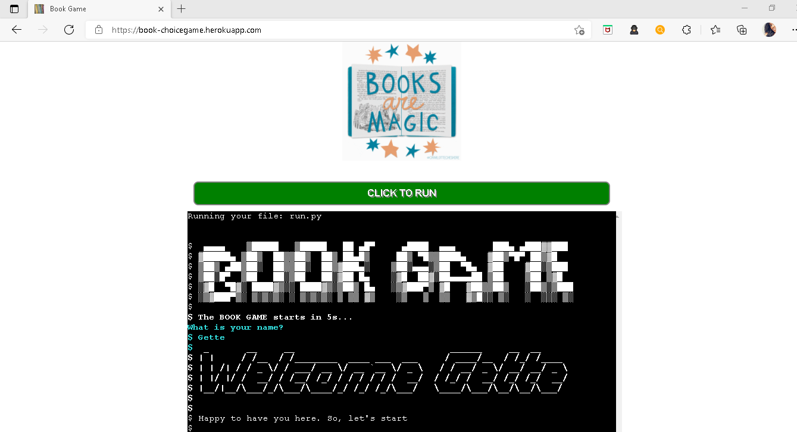
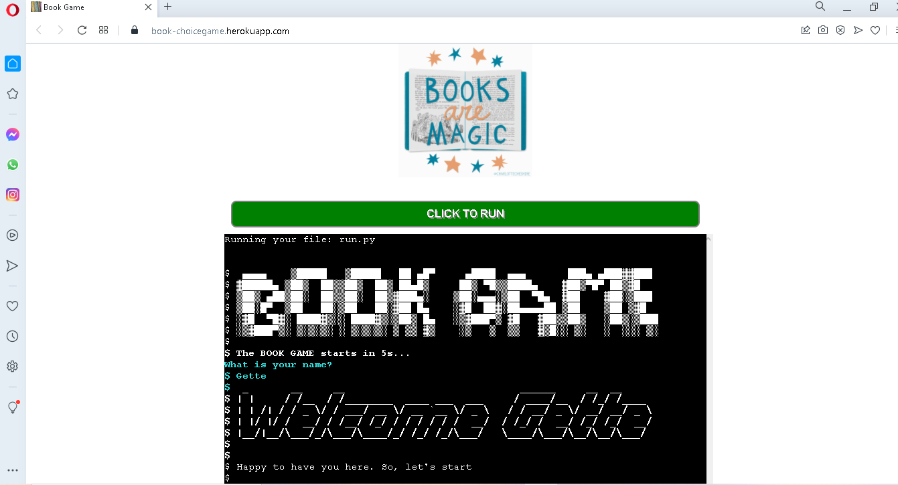

# Book Game - Testing

[Main README.md file](https://github.com/Georgette-Lumbe/book_game/blob/main/README.md)

[View live project](https://book-choicegame.herokuapp.com/)

[View website in GitHub pages](https://github.com/Georgette-Lumbe/book_game)

---

# Table of Contents

1. [Manual Testing User Stories](#manual-testing-user-stories "#Goto manual testing user stories")

3. [Automated Testing](#automated-testing "#Goto automated testing")
    * [Code Validation](#code-validation "Goto code validation")
    * [Browser Validation](#browser-validation "Goto browser validation")

4. [User Testing](#user-testing "Goto user testing")

---

# Manual Testing User Stories

* I would like to run the program whenever I want

Each time that user click on the green button, the program will restart

* I would like to choose the type of book that I want

To access the desired type of book, user can type one of the proposed letters (a, r, c or h).

* I would like to choose the book I want

The user can choose the book he wants by typing either 1 or 2.

* I would like to see a feedback after my choice

The user can see the feedback about his choice.

* I would like to make another choice easily

If the user makes a wrong choice, he can make another choice.

* I would like to see a good bye message

There is a good bye message for user after he finishes the game and will propose to run the game by clicking the green button if he wants to play again. 

[Back to top](#testing-user-stories "#Goto testing user stories")

# Automated Testing

## Code Validation

* PEP8 Online Validation was used to validate the code, to ensure there were no syntax errors or improper code.

## Browser Validation

1. Chrome

2. Edge

3. Opera

4. Firefox

# User Testing

Family members and Jimmy, were asked to review, test the the program to point out any bugs and issues.

The following changes were made after their testing:

* Correct some spelling mistakes.
* Review some errors about calling functions.
* Add helper functions, while loop, try and except to alert when user enters a wrong data.
* Change the color of the Welcome message and the message about starting time.
* Make the user choice more flexible. 

 [Back to top](#manual-testing-user-stories "#Goto manual testing user stories")